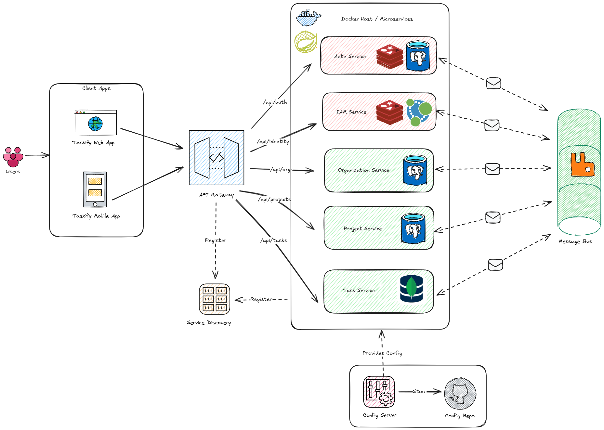

# Taskify - Task Management System

Taskify is a robust, scalable task management system built with a microservices architecture. It serves as a learning-purpose, Jira-like application that follows industry best practices for system design and security.

## System Architecture

Taskify implements a modern microservices architecture with the following components:



### Components Overview

#### 1. Client Applications

-   **Taskify Web App**: React-based web interface
-   **Taskify Mobile App**: Mobile-friendly application (future)

#### 2. API Gateway

Acts as a unified entry point for all client applications, handling:

-   Request routing to appropriate microservices
-   Authentication validation
-   Basic permission checks
-   Load balancing
-   Organization context verification

#### 3. Microservices

Each service is independently deployable, with its own database:

| Service              | Responsibility                     | Database          
| -------------------- | ---------------------------------- | ----------------- 
| Auth Service         | Authentication, JWT management     | PostgreSQL, Redis 
| IAM Service          | Identity and access management     | Neo4j            
| Organization Service | Org management, member invitations | PostgreSQL       
| Project Service      | Project lifecycle management       | PostgreSQL        
| Task Service         | Task creation and management       | MongoDB           

#### 4. Supporting Infrastructure

-   **Service Discovery**: Dynamic service registration and discovery with `Eureka Server`
-   **Message Bus**: Event-driven communication between services with `RabbitMQ`
-   **Configuration Server**: Centralized configuration management with `Config Repo` and `Spring Cloud Config Server`

## Key Features

-   **Multi-Organization Support**: Users can belong to multiple organizations with independent context
-   **JWT Authentication**: Secure authentication with refresh token rotation
-   **Complex Access Control**: Flexible permission system with organization-specific roles and permission overrides
-   **Project Management**: Create and manage projects within organizations
-   **Task Tracking**: Create, assign, and track tasks with custom workflows
-   **User Management**: Invite members, manage roles and permissions

## Authentication & Authorization

### Authentication

-   JWT-based access tokens (15-minute lifespan)
-   UUID-based refresh tokens with rotation pattern
-   Token reuse detection for enhanced security
-   Organization context validation on all requests

### Authorization

Taskify implements a three-tiered permission model:

1. **Application-level**

    - Base roles: Admin and User
    - Control system-wide access
    - Assigned during user creation

2. **Organization-level**

    - Custom roles specific to each organization
    - Different organizations can have different role structures
    - Applied within organization context
    - Managed by organization admins

3. **Resource-level**
    - Permission overrides for specific users
    - Granular access control beyond role permissions
    - Organization-specific
    - Removed when role changes

-   Fast permission verification via Redis caching
-   Neo4j-based permission storage for complex relationship modeling

## Tech Stack

### Backend

-   **Framework**: Spring Boot
-   **Languages**: Java
-   **Databases**:
    -   PostgreSQL: Authentication, Organization, and Project data
    -   MongoDB: Task documents
    -   Neo4j: Permission and role relationships
    -   Redis: Caching, membership verification, and permission caching
-   **Message Broker**: RabbitMQ for event-driven communication
-   **Containerization**: Docker

### Frontend

-   **Framework**: ReactJS

## Getting Started

### Prerequisites

-   JDK 17+
-   Node.js 16+
-   Docker and Docker Compose
-   Maven

### Local Development Setup

-   Note: The project is under active development and may not be fully functional yet.

## Documentation

Detailed technical documentation is available in the `/docs` directory:

-   System architecture diagrams
-   Authentication flows (JWT and refresh token)
-   Authorization processes
-   Database schema
-   API specifications

## Service Responsibilities

### Auth Service
- Credential validation
- JWT token generation and validation
- Refresh token management
- Token reuse detection
- **Database Choice**: PostgreSQL provides ACID compliance for critical auth data, while Redis enables fast orgs-context verification

### IAM Service
- Role and permission management
- Permission verification
- Permission overrides handling
- Access control enforcement
- **Database Choice**: Neo4j graph database excels at modeling complex role-permission relationships and hierarchies with superior query performance for permission traversal

### Organization Service
- Organization lifecycle management
- Organization membership
- Member invitation workflow
- Local user data management
- **Database Choice**: PostgreSQL's relational model with foreign key constraints ensures data integrity for organization hierarchies and membership relationships

### Project Service
- Project creation and management
- Project hierarchies
- Project metadata
- **Database Choice**: PostgreSQL provides structured schema with transaction support for maintaining project hierarchy and relationships

### Task Service
- Task creation and tracking
- Task assignments
- Status updates
- Task metadata
- **Database Choice**: MongoDB's document database provides flexibility for varied task structures, fields, and metadata while supporting high write throughput for task updates

## Project Structure

```
taskify/
├── api-gateway/
├── service-discovery/
├── config-server/
├── microservices/
│   ├── auth-service/
│   ├── iam-service/
│   ├── organization-service/
│   ├── project-service/
│   └── task-service/
├── web-client/
├── docs/
│   ├── images/
└── docker/
```
